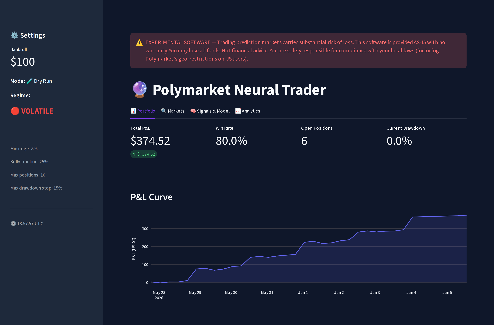
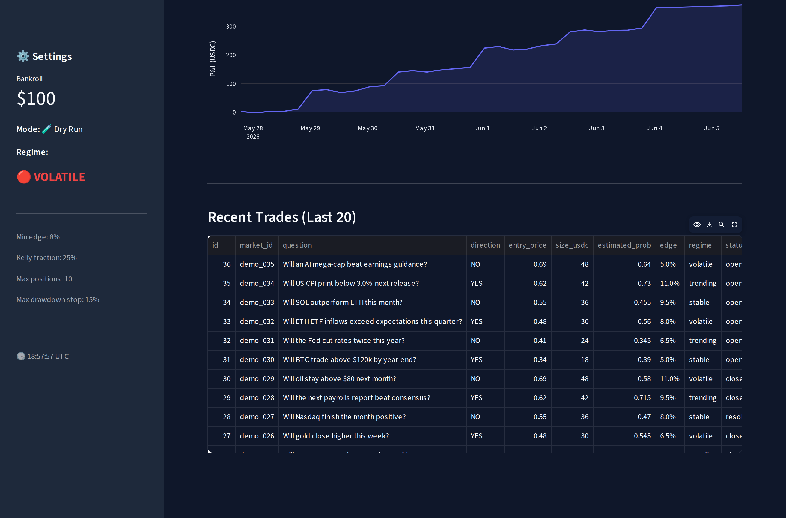
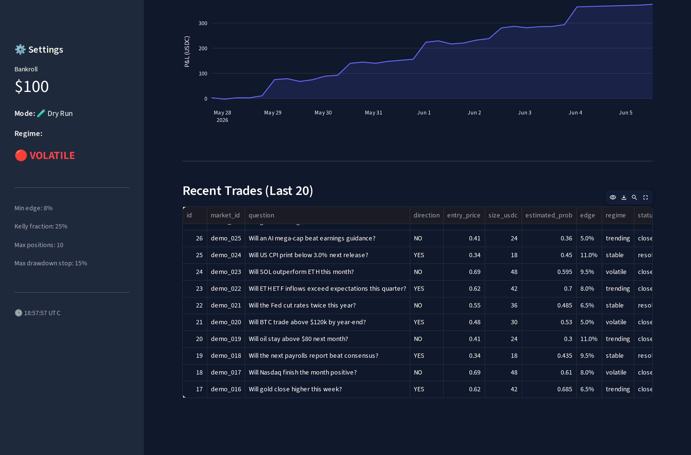
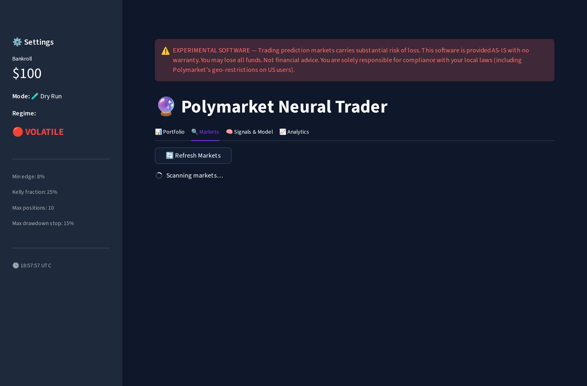

> **⚠️ EXPERIMENTAL SOFTWARE — Trading prediction markets carries substantial risk of loss. This software is provided AS-IS with no warranty. You may lose all funds. Not financial advice. You are solely responsible for compliance with your local laws (including Polymarket's geo-restrictions on US users).**

---

# Pythia

> *Neural oracle for Polymarket prediction markets.*

[](https://github.com/Gauthambinoy20/Pythia/actions/workflows/ci.yml)
[](https://github.com/Gauthambinoy20/Pythia/actions/workflows/security.yml)
[](https://github.com/Gauthambinoy20/Pythia/actions/workflows/codeql.yml)
[](https://github.com/Gauthambinoy20/Pythia/actions/workflows/docs.yml)


Neural trading system for Polymarket prediction markets. Combines Bayesian edge detection, TCN neural net predictions, isotonic probability calibration, HMM regime detection, Claude LLM sentiment, and fractional-Kelly position sizing with defense-in-depth risk controls.

## Screenshots

The Streamlit dashboard running against seeded paper-trading data (`demo-seed`):

| Portfolio overview | P&L curve + live trades |
|---|---|
|  |  |
| **Trade history** | **Market scanner** |
|  |  |

## Why I built this

> _✍️ Draft — tweak to your own voice._

Prediction markets are one of the few places where a probabilistic edge can be
expressed directly as a tradeable price. I built this to find out whether a
disciplined, fully-automated pipeline — real probability estimation, calibration,
regime awareness, and strict risk control — could consistently beat the market's
own implied odds, without ever risking more than a fractional-Kelly stake. Just as
much, it's an end-to-end systems exercise: data ingestion, ML, execution,
persistence, observability and operations wired into one production-grade service
that runs unattended and fails safe.

## Features

- **Data**: Gamma API market scan, CLOB order book, Tavily news, Claude sentiment (cached)
- **Features**: logit returns, RSI, volume momentum, book imbalance, time-decay, cross-market
- **Models**: Bayesian edge + TCN ensemble, isotonic probability calibration, regime-weighted (3-state HMM)
- **Risk**: fractional Kelly × confidence × volatility × regime, per-position/portfolio/category caps, 3-tier drawdown circuit breakers
- **Execution**: limit orders via py-clob-client, order splitting, bracket orders (TP/SL), GTT, paper mode with partial fills
- **Backtest**: full simulator with fees/slippage/spread-impact realism
- **Tracking**: SQLite P&L, Brier calibration, online signal-weight learner
- **Alerts**: JSONL stream + Streamlit dashboard

## Quick start

```bash
python3 -m venv .venv && source .venv/bin/activate
pip install -e ".[dev]"
cp .env.example .env   # fill in keys
pytest                 # 249 tests
python -m polymarket_agent.main demo-seed
streamlit run dashboard/app.py
```

## CLI

```bash
python -m polymarket_agent.main scan         # see candidate markets
python -m polymarket_agent.main trade        # run loop (dry_run in settings.yaml)
python -m polymarket_agent.main demo-seed    # populate dashboard with fake data
python scripts/run_backtest.py               # backtest
python scripts/train_tcn.py                  # retrain TCN
python scripts/collect_history.py            # archive price history
```

## Config

Everything in `config/settings.yaml`. Start with `dry_run: true`.

## Docker

```bash
docker build -t polymarket-trader .
docker run --env-file .env -v $(pwd)/data:/app/data -p 8501:8501 polymarket-trader
```

## Safety

- **Always** start with `dry_run: true` and `bankroll: 100`.
- Drawdown circuit breakers halt new trades at 15% and liquidate at 20%.
- Paper-mode simulates partial fills and slippage before touching real USDC.

## Architecture

```
Gamma API → Market Scan → Feature Engine → Edge Detector → Position Sizer
                ↓                                              ↓
         CLOB Order Book                                  Order Executor
                ↓                                              ↓
         Price History ←──── Regime (HMM) ────→ Signal Weights Learner
                                                               ↓
                                                        Performance Tracker
```

**Core modules**: `main.py` (orchestrator), `executor.py` (order lifecycle), `gamma_client.py` / `clob_client.py` (market data), `edge.py` (signal detection), `sizer.py` (Kelly sizing), `drawdown.py` (risk).

**New modules (v2)**: Event bus, order state machine, WebSocket client, TWAP/trailing stop, batch orders, anomaly detector, alert system, paper trading engine, graceful shutdown, retry/circuit breaker, health checks.

## Production Deployment

```bash
# 1. Configure
cp .env.example .env
# Fill in: POLYMARKET_PRIVATE_KEY, ANTHROPIC_API_KEY, TAVILY_API_KEY

# 2. Validate environment
python -m polymarket_agent.infra.env_validator

# 3. Test with paper trading first
python -m polymarket_agent.main trade --dry-run --once

# 4. Run with Docker
docker-compose up -d
docker-compose logs -f trader
```

### Monitoring
- **Health check**: `scripts/healthcheck.py` (used by Docker HEALTHCHECK)
- **Dashboard**: Streamlit at `http://localhost:8501`
- **Alerts**: `data/alerts.jsonl` + optional Telegram notifications
- **Heartbeat**: `data/heartbeat.json` updated every cycle

## Emergency Procedures

```bash
# Stop all trading immediately
python -m polymarket_agent.main kill-switch on --reason "manual stop"

# Check kill switch status
python -m polymarket_agent.main kill-switch status

# Resume trading
python -m polymarket_agent.main kill-switch off
```

## ⚠️ Risk Disclaimer

This software trades on real prediction markets using real money (USDC). Use at your own risk.

- **Always** test with `dry_run: true` before going live
- Set conservative bankroll and drawdown limits
- Monitor the dashboard and alerts actively
- The kill switch exists for emergencies — know how to use it
- Past performance (including backtests) does not guarantee future results
- This is experimental software — bugs may cause financial loss
