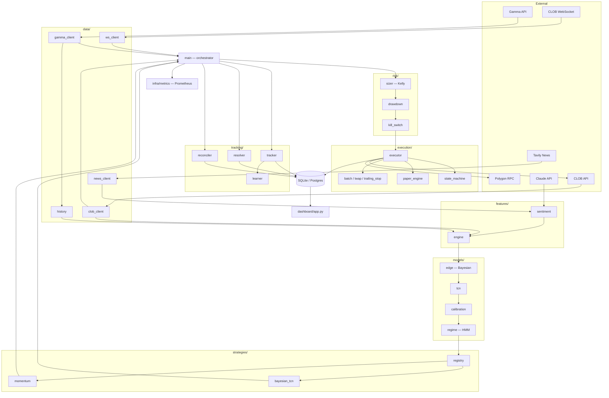
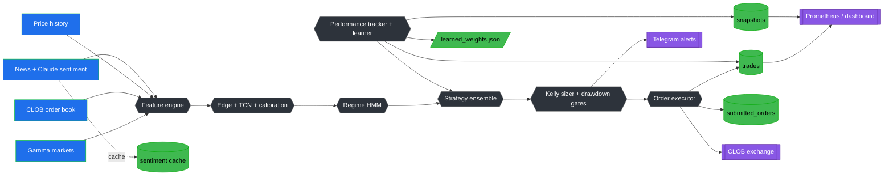
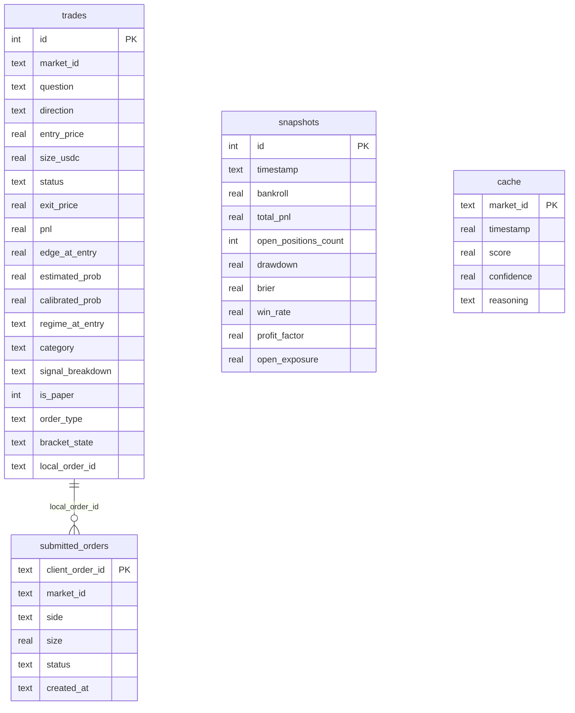

# Diagrams

All diagrams are Mermaid (render natively on GitHub) and are derived from the
actual modules under `src/polymarket_agent/`. The trading-cycle sequence diagram
lives in [architecture.md](architecture.md); this file adds the architecture,
data-flow and entity-relationship views.

## 1. Architecture

How the subsystems connect, from market data through to execution and tracking.

## 2. Data Flow Diagram

Sources → processes → stores → sinks for one trading cycle.

## 3. Trading-cycle sequence

See [architecture.md](architecture.md#sequence-diagram) for the full
request-lifecycle sequence diagram (env validation → scan → feature/edge/size →
risk gates → balance/gas checks → CLOB submission → persistence → metrics).

## 4. Entity-Relationship (persistence)

The persistence layer (`infra/db.py`, `tracking/tracker.py`,
`execution/executor.py`, `features/sentiment.py`). `submitted_orders` is the
idempotency ledger linked to a `trades` row via `local_order_id`.

