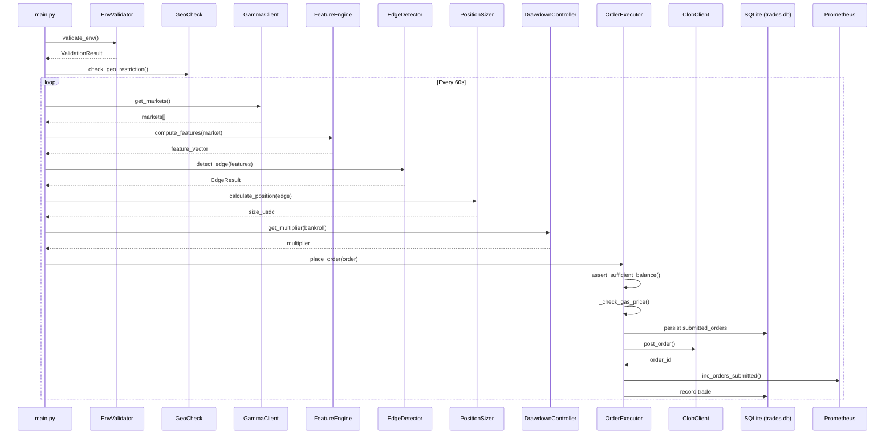

# Architecture

## System Overview

PolymarketTrader is an autonomous neural trading agent for Polymarket prediction markets.

## Sequence Diagram

## Components

| Component | File | Purpose |
|-----------|------|---------|
| Entry Point | `src/polymarket_agent/main.py` | Orchestrates the trading loop |
| Feature Engine | `src/polymarket_agent/features/engine.py` | Order book + sentiment features |
| Edge Detector | `src/polymarket_agent/models/edge.py` | Identifies mispriced markets |
| Position Sizer | `src/polymarket_agent/risk/sizer.py` | Kelly-based position sizing |
| Drawdown Controller | `src/polymarket_agent/risk/drawdown.py` | Risk management + daily loss limits |
| Order Executor | `src/polymarket_agent/execution/executor.py` | Order lifecycle + balance/gas checks |
| CLOB Client | `src/polymarket_agent/data/clob_client.py` | Polymarket order book API |
| Gamma Client | `src/polymarket_agent/data/gamma_client.py` | Polymarket markets API |
| Market Resolver | `src/polymarket_agent/tracking/resolver.py` | Closes resolved positions |
| Rate Limiter | `src/polymarket_agent/infra/rate_limiter.py` | Token-bucket for API calls |
| Polygon RPC | `src/polymarket_agent/infra/polygon_rpc.py` | RPC failover with backoff |
| Dashboard | `dashboard/app.py` | Streamlit monitoring UI (password-protected) |
| Metrics | `src/polymarket_agent/infra/metrics.py` | Prometheus exporter |
